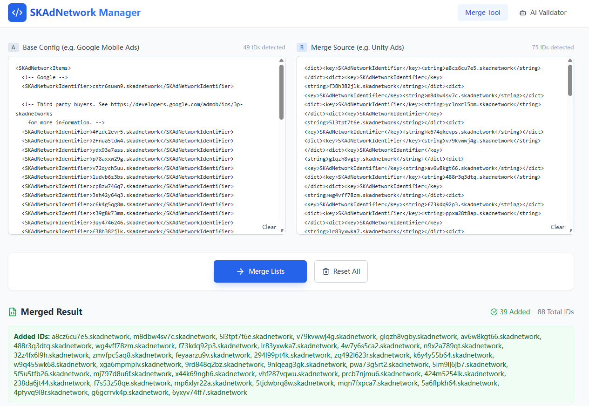
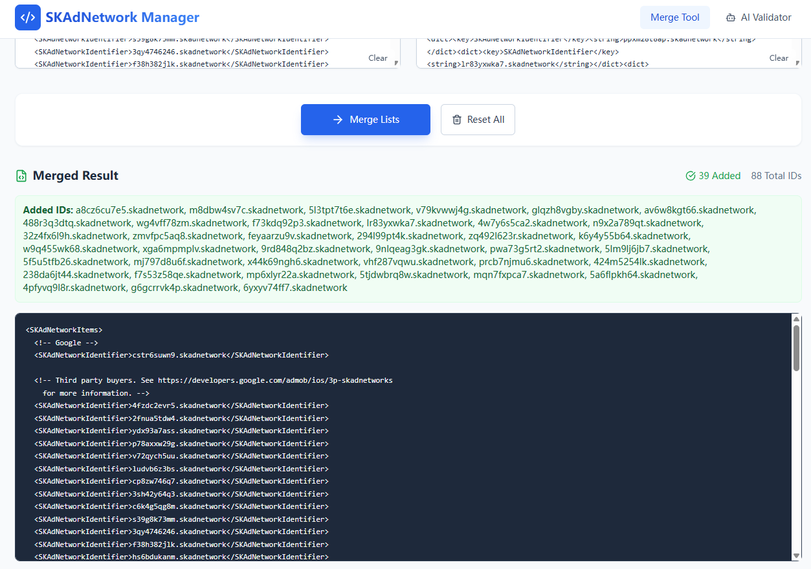
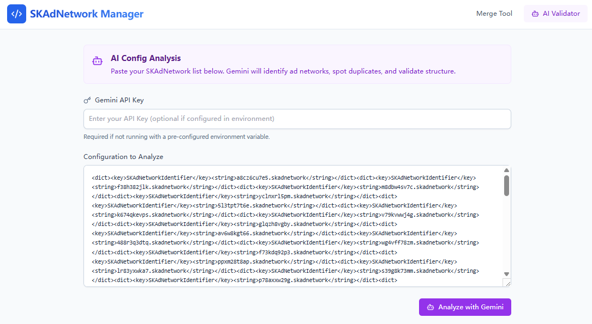

# SKAdNetwork Merger Pro

**SKAdNetwork Merger Pro** is a specialized utility for iOS developers and AdTech professionals. It simplifies the management of `SKAdNetworkIdentifier` lists in `Info.plist` files, which are required for iOS advertising privacy compliance.

## Key Features

### 🔗 Smart Merging
  
  
Seamlessly combine disparate SKAdNetwork lists (e.g., merging Google AdMob defaults with Unity Ads or IronSource lists).
*   **Deduplication:** Automatically detects and ignores duplicate IDs.
*   **Format Agnostic:** Intelligent parsing handles raw ID lists, `<dict>` snippets, or full XML blocks.

### 🤖 AI Config Analysis

  
Powered by **Google Gemini 2.5 Flash**, this feature provides intelligent insights:
*   **Validation:** Checks XML structure validity.
*   **Network Identification:** Identifies major ad networks (Google, AppLovin, Unity, etc.) associated with specific IDs.
*   **Summary:** Provides a brief audit of your current ad network setup.

### 🔒 Secure & Local
*   **Client-Side Processing:** All merging logic happens in your browser.
*   **Direct API Calls:** When using AI features, your API Key and data are sent directly to Google's GenAI endpoint. No intermediate servers store your data.

## Usage

1.  **Merge Tab:** Paste your main `Info.plist` content on the left and the new network IDs on the right. Click **Merge Lists** and copy the result.
2.  **AI Validator Tab:** Enter your Gemini API Key, paste your list, and click **Analyze** to get instant insights.

## Tech Stack

*   React 19
*   TypeScript
*   Tailwind CSS
*   Google GenAI SDK (`gemini-2.5-flash`)
